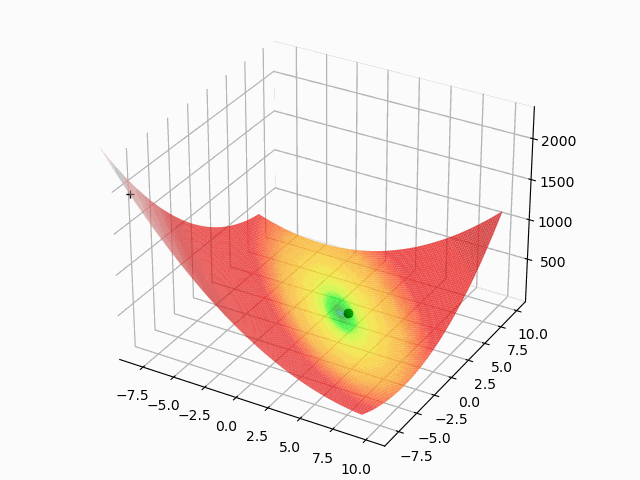

# Evolutionary Optimization

This module can be used to solve optimization tasks.
For instance, you could use this module to tune the hyper-parameters of a neural
network or a decision tree.

## Getting started
### Installation
To install the package, simply run:
```shell script
git clone https://github.com/sachahu1/Evolutionary_Optimization
cd Evolutionary_Optimization
```
Then, set up a virtual environment like so:
```shell script
python3 -m venv ./venv
```
Activate your virtual environment:
```shell script
source venv/bin/activate
```
And install the dependencies:
```shell script
pip3 install -r requirements.txt
```
### Using the package
First go to the right directory:
```shell script
cd Evolutionary_Optimization/src
```
Then, run the code as follows:
```python
python3 train_ea.py
```
### Configuring your experiment
You can easily configure your own optimization problem through the ```Evolutionary_Optimization/src/config.py``` file.
To do so, simply follow these steps:<br>
* Write your own test function which evaluates an individual's genotype into a phenotype (see [these examples](Evolutionary_Optimization/src/test_functions.py)).
* Write your own fitness function which evaluates an individual's phenotype and returns a fitness score (see [these examples](Evolutionary_Optimization/src/loss_functions.py)).
* Define your own genotype in the format of a python Dict with the minimum and maximum values
* Configure the parameters of your experiment

You're all set and ready to solve your optimization problem!

### Examples
Below are a few examples of an evolutionary optimization task being solved. In these examples, the black dot represents the best individual in the population and the cross represents the worst individual.

Booth Function:<br>


Bukin function:<br>


Easom function:<br>


Goldstein-Price function:<br>


Rosenbrock function:<br>


## Documentation
You can consult our documentation [here](https://sachahu1.github.io/Evolutionary_Optimization/).
